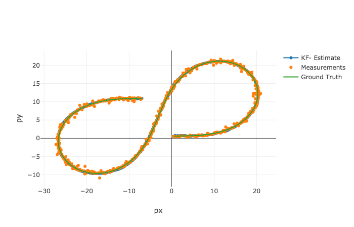

# Object Tracking with Extended Kalman Filter

## Goal

Utilizes sensor data from simulated LIDAR and RADAR measurements for object tracking (e.g. cars, pedestrian or other moving objects) with the Extended Kalman Filter.

The project was created with the [Udacity Starter Code](https://github.com/udacity/CarND-Extended-Kalman-Filter-Project).

## Files
- `scr` a directory with the project code:
  - `main.cpp` - reads in data from input file or simulation tool, run the Kalman filter, and calculate RMSE
  - `FusionEKF.cpp` - initializes the filter, make prediction and then update states per each sensor measurement
  - `kalman_filter.cpp`- defines the predict function, the update function for lidar and radar
  - `tools.cpp` - a function to calculate RMSE and the Jacobian matrix
- `data`  a directory with one input file provided by Udacity
- `results`  a directory with the output log file and visualization image
- `Docs` a directory with files formats description

## Results

### Input data file: obj_pose-laser-radar-synthetic-input.txt


Accuracy
* RMSE: <b>[0.0972256, 0.0853761, 0.450855, 0.439588]</b>. This meets the expectation of RMSE <= [.11, .11, 0.52, 0.52]

The results were visualized with [Sensor Fusion utilities](https://github.com/udacity/CarND-Mercedes-SF-Utilities).

## Run the code
* Compile
```
mkdir build && cd build
cmake .. && make
```
* Run as the server (getting input from the simulator)
```
cd build
./ExtendedKF
```

* Read from the local input data file. It will generate a output file `output.txt` in the same fold for the visualization purpose
```
cd build
/ExtendedKF ../data/obj_pose-laser-radar-synthetic-input.txt 
```
